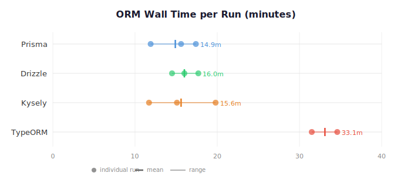

# Agent Fluency Score

An automated benchmark measuring how much friction frameworks introduce when used with AI coding agents, tested across 8 tools in two categories. Not "how good is the agent" — **how agent-friendly is the tool.**

## Results — ORM Category

Each tool was tested 2–3 times with identical prompts, a fresh starter app, and a fresh agent session per run.

| Tool | Runs | Mean First-Attempt Rate | Mean Avg Cycles | Mean Wall Time | Wall Time Range |
|------|:----:|:-----------------------:|:---------------:|:--------------:|:---------------:|
| Drizzle | 3 | 80% (4.0/5) | 0.20 | 16.0m | 14.5–17.7m |
| Kysely | 3 | 67% (3.3/5) | 0.27 | 15.6m | 11.7–19.8m |
| Prisma | 3 | 67% (3.3/5) | 0.33 | 14.9m | 11.9–17.4m |
| TypeORM | 2 | 50% (2.5/5) | 0.50 | 33.1m | 31.5–34.6m |



Drizzle completed 80% of tasks on the first attempt across all three runs. TypeORM required twice the wall time and more correction cycles to reach the same outcomes. Kysely and Prisma landed in the middle with similar time profiles but meaningful run-to-run variance.

Full per-tool breakdowns with efficiency metrics and code changes: [ORM Scorecard](runs/orm/SCORECARD.md)

## Results — Auth Category (Preliminary)

Each tool was tested once with identical prompts, a fresh starter app, and a fresh agent session.

| Tool | Runs | First-Attempt Rate | Avg Cycles | Wall Time |
|------|:----:|:------------------:|:----------:|:---------:|
| Clerk ⚠️ | 1 | 100% (5/5) | 0 | 8.7m |
| Auth0 | 1 | 60% (3/5) | 0.6 | 13.5m |
| PropelAuth | 1 | 60% (3/5) | 0.6 | 11.1m |
| NextAuth | 1 | 60% (3/5) | 0.8 | 13.3m |

> **⚠️ Auth results are preliminary.** A testing parity issue that gave Clerk an unfair advantage (SDK-level testing integration) has been fixed, but auth benchmarks have not yet been re-collected. ORM results are final.

Clerk achieved a perfect first-attempt rate, but these results should be interpreted with the above caveat. Auth0, PropelAuth, and NextAuth clustered together with similar first-attempt rates and wall times.

Full per-tool breakdowns with efficiency metrics and code changes: [Auth Scorecard](runs/auth/SCORECARD.md)

## What It Measures

Same prompts. Same starter app. Same verification tests. Different tools. The benchmark measures the **outcome** — friction — not the cause. Training data coverage, API design, error message clarity, and configuration complexity all contribute. We don't decompose which factor dominates; we measure the aggregate effect a developer would experience.

A tool scores well when the agent gets it right on the first try. A tool scores poorly when the agent burns through correction cycles, hallucinating APIs that don't exist or chasing opaque error messages.

## How It Works

The orchestrator drives a coding agent programmatically via `claude -p`, using zero-coaching prompts — natural-language instructions with no hints, no docs, no code snippets. For each task:

1. Sends the prompt to the agent
2. Runs `npm run build` to verify compilation
3. Runs Playwright E2E tests to verify functionality
4. On failure: forwards the exact error back to the agent (up to 10 correction cycles)
5. Records first-attempt success, correction cycles, wall time, and all agent metrics

Each tool goes through 5 tasks of escalating complexity (Basic Setup → Core Feature → Integration → Production → Advanced). Multiple independent runs per tool capture variance.

## Getting Started

### Prerequisites

- Node.js 18+
- PostgreSQL running locally
- Claude Code CLI installed and authenticated
- Playwright browsers installed

### Clone and install

```bash
git clone https://github.com/ecarlsf/agent-fluency-score.git
cd agent-fluency-score/cli
npm install
npx playwright install chromium
```

### Configure

```bash
cp ../starter-app/.env.example ../starter-app/.env
```

Edit `starter-app/.env` and set your `DATABASE_URL`. For auth benchmarks, you'll also need provider API keys (Clerk, Auth0, etc.) — these go in `runs/auth/<tool>/.env` after setup.

### Run a benchmark

```bash
npx tsx src/index.ts auto-run -c orm -t prisma --force --runs 3
```

### View results

```bash
npx tsx src/index.ts aggregate
```

## CLI Reference

| Command | Description |
|---------|-------------|
| `auto-run -c <category> -t <tool>` | Run a fully automated benchmark (no human intervention) |
| `run -c <category> -t <tool>` | Run a benchmark interactively |
| `setup -c <category> -t <tool>` | Prepare a tool directory for benchmarking |
| `scorecard -c <category>` | Generate comparison scorecard from completed runs |
| `aggregate` | Generate cross-category aggregate report |
| `list` | List available categories and tools |

**Flags:** `--runs N` runs N independent benchmark runs. `--force` replaces the existing tool directory (preserves `.env`).

## Categories

**Auth** — Clerk, Auth0, PropelAuth, NextAuth, Supabase Auth, Firebase Auth
Tasks: Basic Setup → OAuth → Route Protection → Session Management → Organizations

**ORM** — Prisma, Drizzle, Kysely, TypeORM
Tasks: Basic Setup → CRUD Operations → Filtering & Pagination → Transactions → Soft Deletes

## Methodology

Full protocol details are in [BENCHMARK_PROTOCOL.md](BENCHMARK_PROTOCOL.md). Key points:

- **Fresh starter app per run** — each run starts from the same baseline commit
- **Fresh agent session** — no memory or context carried between runs
- **Database reset between runs** — clean state for every benchmark
- **Identical prompts** — only the tool name is substituted
- **Zero-coaching protocol** — no documentation, no hints, no code snippets in prompts
- **Environmental requirement** — no concurrent agent sessions during benchmark runs

## Limitations

- **Single agent:** Claude Code only. Future iterations may add Cursor, Codex, and others.
- **Single environment:** Next.js 14 App Router. Results may differ for other frameworks.
- **Small sample sizes:** 2–3 runs per tool. Enough to show patterns, not statistically rigorous.
- **Training data is part of what's being measured, not a confound.** A tool with better training data representation *is* more agent-friendly — that's the point.
- **Run-to-run variance is significant.** Don't over-interpret small differences between tools with overlapping ranges.

## Contributing

**Add a new tool to an existing category:** Create a test helper in `cli/tests/helpers/`, add the tool name to the category's `tools` array in `cli/src/tasks/`, and run the benchmark.

**Add a new category:** Create a task definition in `cli/src/tasks/`, register it in `cli/src/tasks/index.ts`, add corresponding Playwright test specs in `cli/tests/`, and build a starter app.

See [open issues](https://github.com/ecarlsf/agent-fluency-score/issues) for planned work.

## License

[MIT](LICENSE)
